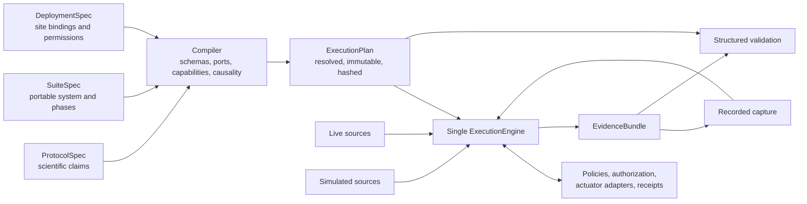

# EEGle Architecture and Product Vision

**Status:** Normative source of truth for EEGle's intended product and architecture  
**Last updated:** 2026-07-22  
**Related documents:** [Migration plan](MIGRATION.md) · [Migration status](MIGRATION_STATUS.md)

This document defines what EEGle is intended to become. It is the authority for
product scope, architectural boundaries, execution semantics, and the meaning of
EEGle's public guarantees. Existing code describes the current implementation;
it does not override this design. `ARCHITECTURE.md`, `ROADMAP.md`, and
`OPEN_SOURCE_LIBRARY_REVIEW.md` remain useful records of the present and past,
but this document governs new architecture and migration decisions.

## 1. Product definition

> **EEGle is an EEG-first, neurophysiology-general framework for specifying,
> compiling, running, recording, replaying, and validating time-synchronized
> model systems, with explicit evidence of what information was available for
> every prediction and action.**

EEGle's differentiator is not another collection of EEG preprocessing functions,
another task renderer, or another model zoo. Its durable value is the ability to
turn a scientific system definition into a resolved execution plan, run that plan
against live, simulated, or recorded sources, and produce evidence sufficient to
answer:

- What exactly ran?
- What data and state were available to each decision?
- Which samples, events, labels, and outcomes were accepted or rejected?
- Did the live and replay executions have the declared degree of equivalence?
- Were timing, causality, data quality, model performance, and device actions
  valid under the declared protocol?
- Can another person reproduce, adapt, and revalidate the system without
  reconstructing undocumented laboratory assumptions?

The verified object is a complete model system:

```text
source
→ clock mapping
→ preprocessing
→ buffering and windowing
→ quality gates
→ model
→ calibration and adaptation
→ decision policy
→ requested action
→ device receipt
```

The “model” may be a threshold detector, a spectral estimator, an sklearn
pipeline, a neural network, an adaptive decoder, an ensemble, or an external
service. EEGle validates the execution context around it as well as its outputs.

## 2. Public product model: the four competencies

The four competencies are the public way to understand EEGle. They share a
single typed execution substrate; they are not separate products.

### 2.1 Reproduce

Declare, exchange, inspect, compile, lock, and adapt a complete experiment or
model-system definition.

Reproduce includes:

- portable scientific protocol definitions;
- reusable suite and phase composition;
- site-specific deployment bindings;
- typed component configuration and validation;
- plugin discovery and capability negotiation;
- fully resolved, versioned, content-addressed execution plans;
- precise diagnostics for invalid or incomplete configurations;
- machine-readable definitions suitable for human or AI-assisted authoring;
- plan inspection, comparison, and provenance.

Reproduction is not achieved by saving one JSON file. A reproducible definition
must separate scientific intent from local deployment, resolve defaults and
plugins, lock versions and artifacts, and retain enough evidence to determine
whether a later execution is comparable.

### 2.2 Record

Execute a compiled plan against live or simulated sources and preserve the exact
inputs, outputs, decisions, state transitions, timing, and actions needed to
understand and replay the run.

Record includes:

- acquisition from one or more dense, sparse, event, and metadata streams;
- explicit clock identity and time mapping;
- exact execution capture of the data admitted to the engine;
- prediction, rejection, skip, pending, timeout, and failure accounting;
- primary, shadow, observer, and candidate model roles;
- model, calibration, adaptation, policy, and component state snapshots;
- action commands, authorization decisions, acknowledgements, and receipts;
- crash-aware, checksummed, append-oriented evidence writing;
- structured logs and metrics suitable for software and scientific review;
- references to source-native or archival raw recordings.

Record supports observe-only systems as a first-class mode. Recording a model's
predictions does not imply that EEGle altered the experiment or controlled a
device.

### 2.3 Replay

Feed recorded inputs through the same execution engine, preserving or deliberately
changing the declared timing and component semantics.

Replay includes:

- faithful re-execution of the original plan;
- accelerated causal replay using original availability ordering;
- counterfactual replay with replaced models, transforms, policies, or
  parameters;
- retrospective and oracle research modes that are explicitly distinguished
  from live-equivalent execution;
- reconstruction of adaptive component state;
- comparison of primary and shadow systems on identical admitted inputs;
- trace, semantic, numeric, or bitwise equivalence checks;
- debugging and localization of divergence across a pipeline.

Replay is not merely rereading a file. It is a controlled execution with an
explicit clock, availability policy, state restoration policy, and equivalence
claim.

### 2.4 Validate

Determine whether definitions, inputs, execution, timing, decisions, actions,
and results satisfy the declared protocol and acceptance criteria.

Validation includes:

- schema and configuration validity;
- plugin, port, type, unit, rate, channel, and capability compatibility;
- recording integrity and completeness;
- clock alignment and synchronization uncertainty;
- time-causal availability and label-leakage checks;
- signal, event, window, and epoch quality;
- prediction coverage and explicit rejection accounting;
- latency, throughput, queueing, deadlines, and backpressure;
- calibration and adaptation validity;
- primary/shadow and candidate comparisons;
- predictive, statistical, and protocol-level performance metrics;
- replay equivalence and divergence localization;
- action authorization, acknowledgement, delivery, and timing;
- cross-session, cross-subject, and cross-deployment acceptance criteria.

Validation returns structured results. Human-readable reports and plots are
presentations of those results and remain optional.

## 3. Scope and non-goals

### 3.1 EEG-first, neurophysiology-general

EEG is the initial reference modality because it drives the present code,
fixtures, and laboratory experience. It is not a restriction in the core data
model.

The kernel must be able to represent:

- EEG, ECoG, sEEG, LFP, MEG, and OPM-MEG;
- fNIRS and other slow hemodynamic measurements;
- Neuropixels and other high-density electrophysiology, including dense LFP and
  sparse spike events;
- EMG, ECG, EOG, eye tracking, respiration, motion, and environmental signals;
- experiment markers, behavioral responses, annotations, outcomes, and device
  state;
- audiovisual, haptic, robotic, TMS, tES, DBS, neurofeedback, and other action
  targets through external device adapters.

Support is described using four explicit levels:

1. **Representable:** core contracts can express the data and timing.
2. **Adapter available:** an integration can ingest, emit, or export it.
3. **Validated:** throughput, timing, capture, and replay have passed modality-
   appropriate acceptance tests.
4. **Reference-supported:** EEGle maintains examples, fixtures, documentation,
   and release tests for it.

Only capabilities that have reached a given level may be advertised at that
level. EEG should be the first reference-supported modality. Generality in the
types must not be confused with validated hardware support.

### 3.2 EEGle owns

EEGle owns the semantics that make the four competencies trustworthy:

- specification, composition, schema validation, and compilation;
- typed runtime contracts and component lifecycle;
- clock, availability, ordering, and causality semantics;
- one live, simulated, and replay execution engine;
- evidence capture, state provenance, and artifact integrity;
- replay modes and equivalence comparison;
- layered validation and acceptance results;
- model roles, outcome timing, calibration, and adaptation provenance;
- action commands, policy provenance, authorization boundaries, and receipts;
- plugin contracts, discovery, capabilities, and locked resolution;
- simulation primitives needed to test the system without laboratory hardware.

### 3.3 EEGle integrates but does not absorb

First-party integrations may be maintained for:

- LSL and MNE-LSL streaming;
- MNE objects and neurophysiology file import;
- sklearn, Torch, Braindecode, and external model services;
- MOABB benchmarks;
- PsychoPy task bridges;
- NWB, BIDS, XDF, Zarr, and other suitable stores or exchange formats;
- vendor acquisition SDKs and actuator drivers when maintainable.

These implementations must enter through stable EEGle contracts. They are not
kernel dependencies merely because they are important integrations.

### 3.4 EEGle does not own

The base package should not ship:

- complete behavioral task applications or study-specific experiment suites;
- PsychoPy drawing code, task instructions, dashboards, or participant UI;
- vendor driver stacks or clinical device safety systems;
- large model zoos, training corpora, or public dataset downloaders;
- arbitrary workflow orchestration unrelated to time-synchronized model systems;
- a general-purpose DAG language or arbitrary Python embedded in JSON;
- a universal raw neurophysiology file format;
- clinical efficacy or device-safety claims;
- compatibility layers for every historical EEGle command, session layout, or
  internal class.

Reference recipes may exist outside the base package to demonstrate the public
contracts. They are clients of EEGle, not architectural foundations.

EEGle does not depend on Timeflux, BCI2000, Dareplane, OpenViBE, or similar
orchestration systems. Interoperation may occur through streams, files, sockets,
or plugins.

## 4. Architectural model

The core product flow is:

```text
ProtocolSpec + SuiteSpec + DeploymentSpec
                  ↓
               Compiler
                  ↓
      immutable ExecutionPlan + lock manifest
                  ↓
       one deterministic ExecutionEngine
        ↙             ↓               ↘
   live sources   simulated sources   replay sources
                  ↓
             EvidenceBundle
                  ↓
       replay, compare, validate, export
```



### 4.1 The five durable artifacts

#### `ProtocolSpec`

The portable scientific contract. It defines the hypotheses or goals, execution
mode, populations or conditions, required observations, metrics, acceptance
criteria, and which claims are permitted. It must not contain site credentials
or machine-specific paths.

#### `SuiteSpec`

The portable executable intent. It defines phases, logical streams, processing
components, models and roles, outcomes, policies, recording requirements,
observers, and data routes. It identifies plugins symbolically and declares
required capabilities.

#### `DeploymentSpec`

The local binding. It maps logical resources to devices, stream selectors,
processes, storage locations, authorization providers, and secrets references.
It allows one suite to run at multiple sites without editing its scientific
definition.

#### `ExecutionPlan`

The compiler's immutable output. It contains resolved plugins, typed ports,
explicit defaults, component parameters, versions, hashes, resource bindings,
phase transitions, clock policies, recording policy, and validation rules. The
runtime consumes this plan; it does not interpret the original dictionaries.

#### `EvidenceBundle`

The versioned output of a run. It contains or references the plan, manifests,
admitted inputs, normalized events, outputs, state transitions, component state,
actions, receipts, integrity records, and validation results required for the
declared replay and validation claims.

### 4.2 Domain specification, not arbitrary graph programming

Users author a neurophysiology model-system suite. The compiler derives and
validates a typed port graph from that domain definition. The configuration must
not become a general programming language.

The suite may declare:

- signal, event, metadata, and outcome sources;
- phases and bounded transitions;
- transforms, buffers, windows, quality gates, models, and policies;
- model roles and comparison groups;
- recording and retention requirements;
- validation and acceptance criteria.

Custom algorithms are normal Python plugins with configuration schemas. JSON is
for declarative intent, not executable source code.

### 4.3 Phase state machine

Experiments and validation suites often require calibration, training,
evaluation, online observation, or follow-up phases. EEGle should model these as
a bounded, inspectable state machine, not as a collection of unrelated scripts.

Every phase may define:

- entry requirements and required upstream artifacts;
- components and resources active in that phase;
- completion and acceptance criteria;
- abort, timeout, retry, and resume semantics;
- artifacts produced and their schema;
- allowed next phases;
- whether operator confirmation is required.

The state transition ledger is part of the evidence bundle. A suite may be
adapted or composed without assuming that every study uses one fixed phase
sequence.

## 5. Time, clocks, and causality

### 5.1 Meaning of causal

In EEGle, “causal” means **time-causal execution**. It does not mean causal
inference and makes no claim about biological causation.

For a prediction or action at decision time `t`, every sample, event, label,
calibration value, state update, and mapping used by that decision must have been
available to the running system by `t` under the selected execution mode.

EEGle distinguishes at least:

- `event_time`: when the represented event occurred in its domain;
- `source_time`: timestamp assigned by the source device or service;
- `received_time`: when the EEGle boundary received the datum;
- `available_time`: when the engine permitted a component to use it;
- `processed_time`: when a transform or model completed;
- `decision_time`: when a policy completed its decision;
- `action_time`: when an action command was submitted;
- `delivered_time`: when an actuator reported or measurement confirmed delivery.

Each timestamp carries a clock identity. Clock mappings are versioned records
with uncertainty, validity intervals, and provenance. Corrections made after a
session must not be represented as if they were available online.

### 5.2 Execution modes

| Mode | Information policy | Permitted claim |
|---|---|---|
| `causal` | Only information available by the relevant decision time | Live-equivalent or deployable under the declared conditions |
| `retrospective` | Full-session transforms, repair, labels, or hindsight alignment may be used | Offline analysis only |
| `oracle` | Future or privileged information is deliberately admitted | Research upper bound only |

The compiler must reject components incompatible with a declared causal plan,
such as zero-phase filtering or a label source that becomes available only after
the decision. Retrospective and oracle execution are valuable, but their results
must never be silently promoted to causal claims.

### 5.3 Causal execution does not imply low latency

A causal fNIRS system may issue a prediction after a long hemodynamic window. A
causal adaptive decoder may update only after a delayed outcome. Causality is an
information-availability guarantee; latency and deadlines are separate protocol
requirements.

## 6. Modality-neutral data plane

Core records must not assume scalp electrodes, microvolts, low channel counts,
fixed sensor locations, regularly sampled arrays, or stimulus-locked epochs.

Minimum data-plane types include:

### `StreamSpec`

Describes a revisioned logical stream: identity, modality, content kind, rate
model, numeric dtype where applicable, channels, units, layout, clock,
coordinate frame, geometry reference/revision, source capabilities, and quality
expectations.

### `ChannelSpec`

Describes channel identity, type, unit, sensor or anatomical reference, and
optional geometry. Channel identity is stable even when ordering changes.

### `DenseSampleBatch`

Represents dense samples bound to an exact stream revision, with channel
identity, sample or batch timing, availability, sequence information, and
provenance. It accommodates regular and irregular rates when explicitly
declared.

### `SparseEventBatch`

Represents spikes, markers, behavioral events, detections, annotations, and
other sparse observations without forcing them into a dense array.

### `MetadataEvent`

Represents a change in sensor position, montage, impedance, device state,
calibration, stream schema, or other time-varying metadata.

### `ClockMapping`

Represents a revisioned measured or declared relationship between two clocks,
including uncertainty, when the mapping became available for causal use, and
the interval for which the mapping is valid.

### `ActionCommand` and `ActionReceipt`

Represent the requested action and the independently observed device response,
including intended and actual timing, authorization, failure, cancellation, and
clock identities.

All records require stable identifiers, schema versions, and lineage sufficient
to associate derived outputs with admitted inputs and component state. Derived
lineage records the latest admitted-input availability in the execution clock
and the stream and clock-mapping revisions used.

## 7. Component and plugin model

EEGle should use small behavioral protocols and composition rather than deep
inheritance trees. A simple user component may be a plain callable or object.

Conceptual component boundaries are:

```python
Source.read() -> Packet | None
Transform.update(packet, context) -> Packet | None
WindowBuilder.update(packet, context) -> Iterable[Window]
QualityGate.evaluate(item, context) -> QualityDecision
Model.predict(item, context) -> Prediction
OutcomeResolver.update(packet, context) -> Iterable[Outcome]
Adapter.update(outcome, state, context) -> StateUpdate | None
Policy.decide(prediction, state, context) -> ActionDecision
Actuator.submit(command, context) -> ActionReceipt
Sink.append(record) -> None
```

Exact signatures may evolve during implementation, but these responsibilities
must stay separable.

Every plugin must provide:

- a stable plugin identifier and semantic version;
- a machine-readable configuration schema;
- typed input and output port declarations;
- capabilities and resource requirements;
- supported execution and replay modes;
- state snapshot and restoration behavior;
- determinism and equivalence declarations;
- a factory that creates the executable component;
- package and implementation provenance.

Plugin discovery metadata without an executable factory is insufficient.
Compiler resolution must produce a locked reference to the exact implementation.

## 8. Single execution engine

Live, simulated, and replay inputs must enter the same execution engine. Separate
scientific logic for online and offline paths creates silent semantic drift and
weakens every replay claim.

The engine owns:

- component lifecycle and phase state;
- packet admission, ordering, routing, and watermarks;
- clock and availability enforcement;
- buffering, deadlines, queue limits, and backpressure;
- scheduled and event-driven work;
- primary, shadow, observer, and candidate roles;
- explicit prediction, rejection, skip, pending, timeout, and error states;
- outcome delivery and adaptation state transitions;
- action decision and receipt recording;
- state snapshots and deterministic restoration where declared;
- evidence emission and run termination semantics.

The engine does not own task drawing, a model framework's internal training
algorithm, a vendor's acquisition loop, or a device's clinical safety system.

Runtime components receive typed objects from a validated `ExecutionPlan`.
Unvalidated dictionaries must not flow through the engine. Runtime behavior must
not depend on a repository root, current working directory, or global mutation of
`HOME` or third-party environment variables.

### 8.1 Scheduling requirements

The engine must be able to express:

- continuous transforms and fixed or adaptive windows;
- event-triggered and state-triggered processing;
- multi-rate and asynchronous input streams;
- deadlines, lateness policy, and backpressure;
- primary-first scheduling with optional shadow work;
- staged feature computation and shared immutable inputs;
- delayed outcomes and bounded pending predictions;
- checkpoint, resume, cancellation, and graceful degradation.

Fairness and resource policies must be explicit. A shadow model must not cause a
primary model to miss a declared deadline unless the plan explicitly permits it.

The reference scheduling model is a deterministic hybrid coordinator:

- semantic dispatch is a single ordered loop over a virtual execution clock;
- acquisition, heavyweight inference, and hardware I/O may run behind typed
  proxies, but they do not create another semantic engine;
- every source publishes a monotonic availability watermark stating that it
  will not later emit an earlier on-time packet;
- an input is dispatchable only when its availability time is at or before the
  minimum watermark of active contributing sources;
- equal-availability inputs use a locked total order over source, stream
  revision, sequence, and packet identity;
- lateness, queue overflow, deadline expiry, and shadow shedding follow explicit
  plan policies and always produce evidence.

This keeps live execution responsive without making thread timing, operating
system scheduling, or process arrival order part of the scientific semantics.

### 8.2 Process boundaries

In-process components are the reference implementation. A subprocess or
external component participates through a typed proxy that preserves component
identity, version, inputs, availability, deadline, cancellation, result, state,
health, and backpressure information. Placement is deployment metadata, not a
different runtime or scientific code path.

The semantic engine owns admission and disposition on both sides of the proxy.
A worker may compute a result, but it cannot silently accept different inputs,
change ordering, or invent a successful terminal state. Process supervision and
transport recovery remain separable deployment responsibilities.

## 9. Models, outcomes, calibration, and adaptation

### 9.1 Model contract

A model bundle should declare:

- model identity, version, implementation, and content hashes;
- input ports, channel and unit expectations, rate and window requirements;
- preprocessing ownership and compatible transform lineage;
- output schema, labels or targets, calibration, and confidence semantics;
- statefulness, snapshot behavior, determinism, and replay level;
- supported execution modes and hardware requirements;
- training and evaluation provenance when available.

Inference metadata must remain label-blind. Stimulus condition, response
correctness, trial label, or later outcome must not be included in model inputs
unless the protocol explicitly declares a non-causal research mode.

### 9.2 Roles

EEGle supports named model roles rather than task-specific branches:

- `primary`: supplies predictions to the active policy;
- `shadow`: receives equivalent admitted inputs but cannot control actions;
- `candidate`: a comparison role with explicitly declared permissions;
- `observer`: produces metrics or annotations without participating in policy;
- custom roles whose permissions are resolved by the compiler.

Role permissions, scheduling priority, accepted inputs, and action authority are
part of the locked plan and evidence.

### 9.3 Outcomes and delayed labels

Predictions and outcomes are separate records. An outcome declares what it
refers to, when it occurred, when it became available, its source, and whether it
may be used for metrics, calibration, adaptation, or policy.

The engine must support delayed and missing outcomes without inventing labels.
Pending, matched, expired, duplicated, and rejected outcomes are explicitly
accounted for.

### 9.4 Adaptation

Adaptation is a state transition, not an invisible side effect. Every accepted
update records:

- triggering prediction and outcome;
- eligibility and policy decision;
- prior and resulting state identifiers or hashes;
- algorithm and parameters;
- timestamps and availability;
- failure, rejection, rollback, or no-op reason.

Replay must restore and advance adaptive state under the declared replay policy.

## 10. Actions and device boundaries

Actuators are first-class architectural participants, but device drivers and
clinical safety logic do not belong in the kernel.

An action path separates:

1. model output;
2. policy decision;
3. requested command;
4. site authorization and interlock decision;
5. device adapter submission;
6. acknowledgement or measured receipt.

A suite can request an action capability. It cannot grant itself permission to
stimulate. Authorization is supplied by the deployment and an independent local
policy or interlock. Observe-only should be a normal authorization policy, not a
special-case implementation.

Core evidence records:

- the prediction and policy state that produced the request;
- command parameters and intended delivery time;
- capability and authorization decisions;
- device and clock identities;
- acknowledgement, measured delivery time, expiry, cancellation, or failure;
- any discrepancy between requested and observed behavior.

EEGle may validate command timing and provenance. It must not imply that a
generic adapter provides medical, electrical, or operational safety.

## 11. Recording and evidence

### 11.1 Execution capture and archival raw recording

EEGle distinguishes two related products:

**Execution capture** preserves the exact samples and events admitted to the
engine, normalized records, component outputs, state, decisions, actions, and
integrity information required for the declared replay claim.

**Archival raw recording** preserves source-native or lossless acquisition data
for future scientific use. It may use XDF, BIDS, NWB, Zarr, or a modality-
appropriate store and may be far larger than the execution evidence.

For a modest EEG session these may be colocated. For high-density recording the
evidence bundle may contain a content-addressed reference to an external raw
store. EEGle therefore defines `SampleStore` and artifact protocols rather than
one universal file format.

### 11.2 Evidence bundle requirements

An evidence bundle should be self-describing and include or reference:

- bundle and record schemas;
- suite, deployment redaction, execution plan, and lock manifests;
- component, package, model, configuration, and artifact hashes;
- admitted input capture and original sequence information;
- normalized events, predictions, quality decisions, outcomes, and actions;
- component and phase state transitions;
- clock mappings and synchronization uncertainty;
- state checkpoints and replay metadata;
- truncation, recovery, and integrity records;
- structured validation results;
- external raw-data references and sensitivity classification.

Writes should be append-oriented, crash-detectable, checksummed where useful,
and resilient to partial final records. Derived corrections belong in derived
artifacts; raw ledgers remain truthful and append-only.

### 11.2.1 Versioned storage model

The initial storage model has three independent layers:

```text
Session
├── ArtifactStore                    namespaced registry and content references
└── EvidenceBundle[]                 one versioned result per execution
    ├── semantic evidence ledger      normalized events, outputs, transitions
    ├── execution capture[]           exact packets admitted by the engine
    ├── archival raw reference[]       lossless/source-native data, local or external
    ├── component-state snapshot[]    canonical state plus component/version lineage
    └── additional artifacts[]         plan, locks, validation, receipts, reports
```

`Session` identity is independent of participant folders and recipes. The
`ArtifactStore` assigns identity by namespace plus artifact ID and records a
typed content reference; filenames are storage locations, not contracts. An
artifact may be embedded in the session or external while retaining its SHA-256
digest, size, media type, sensitivity, and producing lineage.

`EvidenceBundle` v1 references semantic evidence, admitted execution capture,
raw recording, state, and derived artifacts separately. This prevents a replay
capture from being mistaken for source-native archival data and permits large
raw stores to remain external without weakening the bundle's identity.

Semantic ledgers and the dependency-light reference sample store use canonical
JSON frames with a length prefix and per-frame SHA-256 checksum. Integrity
inspection distinguishes valid, recoverable, and unrecoverable results. A
partial final frame is recoverable only to the last complete byte boundary;
checksum, header, interior, canonicalization, record-hash, or sequence failures
are not silently repaired. Recovery copies the proven prefix and leaves the
source untouched.

Historical `SessionPaths` names may be exposed only through an explicit artifact
alias registry. They are a compatibility view for selected readers and recipes,
not a target runtime API or a required directory layout.

### 11.3 Privacy and sensitivity

Recording policies must support:

- explicit inclusion and exclusion of fields and streams;
- sensitivity classes and redacted deployment manifests;
- external references instead of copying protected raw data;
- retention and export policies;
- participant pseudonyms rather than requiring direct identifiers;
- validation without uploading data to a service.

Secrets and credentials must never be embedded in a portable suite or evidence
bundle. EEGle is not a substitute for institutional governance, consent, or
secure storage.

## 12. Replay and equivalence

### 12.1 Replay modes

The replay request states its timing and information policy:

- `original_availability`: preserve original admission order and availability;
- `accelerated_causal`: run faster than wall time while preserving causal
  ordering and availability relationships;
- `counterfactual`: replace selected components while keeping declared inputs
  comparable;
- `retrospective`: allow explicitly declared offline information and transforms;
- `oracle`: allow privileged future information for upper-bound research.

Wall-clock pacing is independent of causal ordering. Replay may be fast without
becoming retrospective.

### 12.2 Equivalence levels

Components and plans declare the strongest equivalence level they support:

- `bitwise`: serialized outputs and state are identical;
- `numeric`: values agree within declared tolerances;
- `semantic`: normalized decisions, labels, acceptance, and state transitions
  agree even when representation differs;
- `trace`: control-flow and lineage equivalence can be checked, but outputs may
  legitimately vary;
- `non_replayable`: external or nondeterministic behavior cannot be reconstructed;
  only recorded evidence is available.

The validator must not claim a stronger level than the weakest relevant
component permits. Hardware action replay normally substitutes a simulated or
observe-only actuator and compares the recorded command/receipt trace.

The default numeric policy uses recursive comparison with relative tolerance
`1e-7` and absolute tolerance `1e-9`; a suite may lock different justified
tolerances. Bitwise comparison uses canonical serialized payloads. Semantic
comparison normalizes decisions, labels, acceptance, work disposition, state
transitions, and action intent. Trace comparison checks ordered control flow,
roles, and lineage. Snapshot-capable component state is compared when declared.
If any relevant component is `non_replayable`, EEGle reports that limitation
rather than manufacturing an equivalence result.

## 13. Validation architecture

Validation is layered so that scientific conclusions are not confused with
system failures.

| Layer | Representative questions |
|---|---|
| Definition | Are schemas valid, references resolved, and protocol claims coherent? |
| Compatibility | Do types, units, channels, rates, ports, and capabilities match? |
| Integrity | Is the evidence complete, ordered, checksummed, and recoverable? |
| Timing | Are clock mappings, latency, deadlines, and synchronization acceptable? |
| Causality | Was every admitted datum available, and were labels or future samples excluded? |
| Data quality | Were streams, windows, artifacts, and rejection reasons acceptable? |
| Execution | Did components start, stop, route, checkpoint, and account for work correctly? |
| Model | Are coverage, calibration, predictive metrics, and uncertainty acceptable? |
| Adaptation | Were outcomes eligible, state transitions valid, and replay reconstructable? |
| Actions | Were commands permitted, acknowledged, delivered, and timed as declared? |
| Replay | Does the rerun satisfy the declared equivalence level? |
| Protocol | Do session, subject, cohort, and deployment results meet acceptance criteria? |

Every result should carry status, severity, evidence references, applicable
criteria, observed values, and an explanation. `pass`, `fail`, `warning`,
`not_applicable`, and `insufficient_evidence` are distinct outcomes.

## 14. Dependency and distribution policy

### 14.1 Base dependencies

The intended base dependencies are deliberately small:

- NumPy for array and numerical data contracts;
- SciPy for first-party signal processing and statistical validation;
- a JSON Schema validator for portable specification validation;
- `packaging` for version and requirement resolution;
- the Python standard library for protocols, dataclasses, hashing, paths,
  serialization, logging, and plugin metadata.

The planned Python baseline is Python 3.11 or newer, without an artificial upper
bound. Releases should test a stated Python/NumPy/SciPy compatibility matrix.

### 14.2 Optional integration families

Recommended extras or companion distributions include:

| Integration | Purpose |
|---|---|
| `live` / LSL | Live LSL source, marker, and outlet adapters |
| MNE and MNE-LSL | Rich neurophysiology objects, files, metadata, and MNE-native streaming |
| sklearn | Classical estimators, calibration, and baseline training |
| Torch | Neural inference and training adapters |
| Braindecode | Neurophysiology-specific deep learning integration |
| MOABB | Standardized public EEG benchmarks |
| plots | Static plots and report presentation |
| PsychoPy | Task-rendering bridge in its compatible Python environment |
| NWB, BIDS, XDF, Zarr | Format-specific import, export, and storage |

Exact packaging—extras in one repository or companion packages—may be refined,
but optional integrations must not become imports of the base kernel.

### 14.3 Base installation acceptance

`pip install eegle` must be able to:

- validate and compile a suite using built-in components;
- run a simulated or recorded source;
- execute a plain Python callable model;
- write a valid evidence bundle;
- replay it through the same engine;
- produce structured validation and comparison results.

`eegle[live]` should add the primary LSL path. A research convenience extra may
aggregate MNE, sklearn, Torch, Braindecode, MOABB, and plotting under a tested
constraints set without redefining the kernel.

## 15. Target package structure

```text
eegle/
├── specs/
│   ├── protocol.py       # scientific claims and acceptance criteria
│   ├── suite.py          # portable system and phase definitions
│   ├── deployment.py     # site bindings, resources, and permissions
│   ├── schemas.py        # schema identifiers and validation helpers
│   └── composition.py    # deliberate suite composition rules
├── compiler/
│   ├── compile.py        # specs to immutable ExecutionPlan
│   ├── graph.py          # typed port graph construction
│   ├── capabilities.py   # requirement and capability resolution
│   ├── lock.py           # canonical plans, hashes, and manifests
│   └── diagnostics.py    # stable, precise compiler diagnostics
├── streams/
│   ├── packets.py        # dense, sparse, metadata, and event records
│   ├── channels.py       # channel identities, types, units, geometry refs
│   ├── clocks.py         # clock identities and mappings
│   └── sources.py        # source and replay-source protocols
├── processing/
│   ├── transforms.py     # causal and retrospective transforms
│   ├── buffers.py        # time-aware bounded buffers
│   ├── windows.py        # generic event and continuous windows
│   └── quality.py        # quality decisions and reasons
├── models/
│   ├── contracts.py      # modality-neutral model contracts
│   ├── adapters.py       # callable and optional-framework adapters
│   ├── bundles.py        # content-addressed bundles
│   ├── calibration.py    # calibration contracts and methods
│   └── roles.py          # primary, shadow, candidate, observer semantics
├── runtime/
│   ├── engine.py         # the single execution engine
│   ├── scheduling.py     # ordering, deadlines, backpressure, priorities
│   ├── state.py          # component and phase state
│   └── outcomes.py       # delayed outcomes and matching
├── recording/
│   ├── session.py        # generic session identity and lifecycle
│   ├── artifacts.py      # namespaced registry, references, lineage
│   ├── bundles.py        # EvidenceBundle writer, reader, verification
│   ├── evidence.py       # typed semantic record envelopes
│   ├── framing.py        # checksums, truncation and prefix recovery
│   ├── ledgers.py        # contiguous typed semantic ledgers
│   ├── capture.py        # execution-capture authority
│   ├── stores.py         # SampleStore protocol and reference store
│   └── compat.py         # narrow legacy artifact-alias view
├── replay/
│   ├── source.py         # replay inputs and virtual timing
│   ├── runner.py         # replay through ExecutionEngine
│   └── compare.py        # equivalence and divergence comparison
├── validation/
│   ├── config.py
│   ├── compatibility.py
│   ├── causality.py
│   ├── integrity.py
│   ├── timing.py
│   ├── coverage.py
│   ├── replay.py
│   └── evaluation.py
├── actions/
│   ├── policies.py
│   ├── commands.py
│   ├── authorization.py
│   ├── actuators.py
│   └── receipts.py
├── plugins/
│   ├── registry.py
│   ├── entrypoints.py
│   └── capabilities.py
└── simulation/
    ├── clock.py
    ├── sources.py
    └── scenarios.py
```

This is a responsibility map, not a mandate for one file per concept. It should
remain possible to understand the kernel without importing tasks, dashboards,
hardware SDKs, or machine-learning frameworks.

## 16. Intended user experience

### 16.1 Command line

The target CLI is small and artifact-oriented:

```bash
eegle compile suite.json --deployment lab.json --out suite.lock.json
eegle validate suite.json --deployment lab.json
eegle run suite.lock.json
eegle replay session/
eegle compare session/ --replace-model candidate.bundle
eegle inspect session/
eegle export session/ --format nwb
```

Old recipe names are not part of the target CLI. Reference recipes may wrap
these generic commands in their own packages or repositories.

### 16.2 Python

The core workflow should be direct:

```python
from eegle import compile_suite, run, replay, validate
from eegle.specs import SuiteSpec, DeploymentSpec

suite = SuiteSpec.load("suite.json")
deployment = DeploymentSpec.load("lab.json")
plan = compile_suite(suite, deployment=deployment)
plan.write_lock("suite.lock.json")

session = run(plan)
replayed = replay(session)
results = validate(session, replayed)
```

Advanced users may construct typed specifications directly or register custom
plugins without subclassing a large framework.

## 17. Architectural invariants

The following are non-negotiable unless this source-of-truth document is
deliberately revised:

1. EEG-first implementation must not create EEG-only kernel types.
2. Live, simulation, and replay use one execution engine.
3. Causal claims are enforced through availability, clock, revision, and lineage
   evidence; predictions record the latest availability of their admitted
   inputs.
4. Retrospective and oracle results are never silently labeled live-equivalent.
5. Runtime consumes a validated, immutable execution plan—not raw dictionaries.
6. Scientific intent and local deployment are separate specifications.
7. Components are small protocols; plugins expose schema, capability, version,
   state, and executable factories.
8. Model inference is label-blind in causal execution.
9. Accepted, rejected, skipped, pending, timed-out, and failed work is explicitly
   accounted for.
10. Primary and shadow systems operate on comparable admitted inputs.
11. Adaptation and phase changes are recorded state transitions.
12. Actions require deployment authorization independent of suite intent.
13. Execution evidence and archival raw recording are separate concepts.
14. Raw ledgers are append-oriented and truthful; corrections are derived.
15. Structured results are core; visual presentation is optional.
16. Base installation does not import task renderers, LSL, MNE, Torch, sklearn,
    vendor SDKs, or plotting packages.
17. Reference recipes consume public EEGle contracts and do not define them.
18. Historical compatibility is selected only when scientifically or
    operationally justified; it is not a default architecture goal.

## 18. Success criteria

EEGle has delivered this vision when an independent user can:

1. describe a portable time-synchronized model suite and a separate site
   deployment;
2. compile them into a deterministic, inspectable lock with actionable errors;
3. run the same plan against simulation, captured data, or a live adapter;
4. use a custom model through a small public protocol;
5. preserve enough evidence to reconstruct every prediction's admitted inputs
   and state;
6. compare a candidate model on exactly comparable inputs without affecting the
   primary system;
7. distinguish causal, retrospective, and oracle results;
8. validate integrity, timing, causality, quality, coverage, model performance,
   replay, and actions independently;
9. share a suite without sharing local credentials, paths, or protected raw
   data;
10. install the base library without the laboratory and research dependency
    stack.

The migration strategy for reaching these criteria is defined in
`MIGRATION.md`; current progress, blockers, and unresolved implementation choices
are maintained in `MIGRATION_STATUS.md`.
