# EEGle Clean-Break Migration Plan

**Status:** Normative migration sequence  
**Last updated:** 2026-07-22  
**Target architecture:** [EEGLE.md](EEGLE.md)  
**Living task tracker:** [MIGRATION_STATUS.md](MIGRATION_STATUS.md)

## 1. Migration thesis

This is not a compatibility-first refactor and not a mechanical move of current
files into new directories.

> **The migration is a selective preservation of proven scientific behavior and
> a clean rebuild of EEGle's product architecture.**

The current repository is valuable in three ways:

1. it contains working algorithms and utilities that may be retained when they
   fit the new contracts;
2. it contains executable examples of timing, replay, model, adaptation, and
   experiment behavior that should become focused acceptance evidence;
3. it exposes boundaries and coupling that the new design should avoid.

It is not necessary to keep old commands, internal classes, task recipes,
session paths, or configuration shapes. Old branches and Git history preserve
the historical implementation. Permanent legacy adapters would consume design
capacity and make the new package less coherent.

The migration may therefore:

- rewrite complete subsystems;
- deliberately diverge from current recipes;
- extract an algorithm without preserving its wrapper;
- replace recipe-shaped tests with behavior-shaped fixtures;
- delete superseded code after its useful behavior has been captured;
- make breaking package, configuration, artifact, and CLI changes.

Any exception—such as a one-time importer for scientifically important recorded
sessions—must be selected explicitly and scoped narrowly.

## 2. What “freeze behavior” means

Phase 1 freezes **scientifically meaningful invariants**, not all present
behavior.

Examples of behavior to freeze:

- inference inputs are label-blind;
- accepted and rejected work is explicitly accounted for;
- primary and shadow models receive comparable admitted inputs;
- capture/replay can reproduce a declared deterministic result;
- delayed outcomes reproduce adaptation state transitions;
- source, receive, and reconstructed times are not silently conflated;
- phase and resume ledgers are truthful and append-oriented;
- model and artifact hashes are verified.

Examples that are not frozen by default:

- old CLI command names or flags;
- the exact `data/<participant>/<session>/...` layout;
- recipe-specific CSV and JSONL filenames;
- PsychoPy task structure and dashboard HTML;
- class names, import paths, or internal worker boundaries;
- automatic resolution relative to the repository root;
- every historical config or model bundle.

Freeze tests should be small, domain-neutral where possible, and readable as
claims about the new architecture.

## 3. Migration rules

1. **Architecture before placement.** A current function moves only after its
   future responsibility is clear.
2. **Extract evidence before deleting behavior.** A fixture, trace, or focused
   test is required for every selected invariant.
3. **Rewrite tangled boundaries.** Do not preserve coupling through a facade just
   to reduce the apparent diff.
4. **No permanent dual runtime.** Temporary side-by-side code is allowed only
   within an active phase and must have a removal task.
5. **One semantic engine.** New live and replay features are built against the
   same runtime from Phase 3 onward.
6. **Recipes are clients.** A recipe may inspire a test or later example, but it
   does not define core types.
7. **Typed after compile.** New runtime code must not accept unvalidated config
   dictionaries.
8. **Optional means import-optional.** Base tests must succeed with integrations
   unavailable.
9. **Keep phase boundaries green.** Each phase ends with a usable, tested
   repository, even if selected old workflows have been removed.
10. **Delete decisively.** Once a path is superseded and its selected evidence is
    captured, remove it instead of maintaining two authorities.
11. **Do not overclaim.** General types do not make a modality or hardware
    adapter validated.
12. **Update the living tracker.** Progress, decisions, risks, and gates belong
    in `MIGRATION_STATUS.md`.

## 4. Phase overview

```mermaid
flowchart LR
    P0["0. Charter and cleanup boundaries"]
    P1["1. Correctness and behavior evidence"]
    P2["2. New foundations"]
    P3["3. Single execution engine"]
    P4["4. Adaptive sessions and evidence"]
    P5["5. Specs and compiler"]
    P6["6. General model, outcome, and action semantics"]
    P7["7. New CLI and integrations"]
    P8["8. Validation depth and public alpha"]

    P0 --> P1 --> P2 --> P3 --> P4 --> P5 --> P6 --> P7 --> P8
```



The sequence expresses dependency, not a ban on exploratory prototypes. A later
concept may be prototyped early to resolve a decision, but its phase gate is not
complete until all prerequisites and acceptance evidence exist.

## 5. Phase 0 — Charter, inventory, and cleanup boundaries

### Objective

Make the target product, migration policy, authority, and deletion criteria
unambiguous before moving code. Clean the repository enough that new work is not
guided by stale or duplicate authority.

### Work

- Adopt `EEGLE.md` as the source of truth.
- Establish this migration plan and `MIGRATION_STATUS.md`.
- Inventory every top-level package and major module as one of:
  - `retain`: already fits the target responsibility with limited revision;
  - `extract`: preserve an algorithm, schema idea, or test behavior only;
  - `rewrite`: responsibility is core but the implementation boundary is wrong;
  - `externalize`: useful integration or recipe outside the base package;
  - `delete`: no longer supports the target product.
- Identify all public imports, console commands, configuration schemas, artifact
  layouts, optional dependencies, process entrypoints, and cross-package cycles.
- Select the smallest non-sensitive current sessions or synthetic traces that
  can prove the behaviors chosen for Phase 1.
- Record the requirement for a scoped, one-time historical artifact importer,
  to be designed only after the new evidence model exists. Do not create a
  general compatibility layer or assume universal readability.
- Use `classify8`, `attention8`, and `dsart8` as the primary reference recipes
  for behavior extraction and possible future external examples. Treat
  `dsart32` as additional deployment-scale evidence for the DSART contract.
- Mark all pre-vision architecture, roadmap, API, recipe, and operator documents
  as legacy implementation evidence where they could conflict with the new
  authority.
- Defer destructive source cleanup until the responsible Phase 2 or Phase 3
  replacement is implemented and verified. Artifact, configuration, and CLI
  cleanup follows the later phase that owns each replacement.
- Define cleanup batches and verification commands so the branch remains
  inspectable after each batch. The authoritative inventory and batches are in
  [PHASE0_INVENTORY.md](PHASE0_INVENTORY.md).

### Current-code context

The present repository is dominated by application-level pipelines, tasks,
workers, and reports. This is useful evidence that study suites should not shape
the kernel. Large files are candidates for responsibility extraction rather
than relocation.

### Exit gate

- Architecture and migration documents are reviewed and accepted.
- A complete keep/extract/rewrite/externalize/delete inventory exists.
- Golden behavior fixtures and their provenance are selected.
- Historical artifact compatibility obligations are explicitly decided.
- Recipe disposition is explicitly decided.
- Old implementation recovery through branches/Git history is confirmed.
- Current test and import baselines are recorded.
- No remaining document is plausibly mistaken for a conflicting future
  architecture authority.

The detailed evidence for this gate is maintained in
[PHASE0_INVENTORY.md](PHASE0_INVENTORY.md) and its machine-readable
[baseline](migration/phase0_baseline.json).

## 6. Phase 1 — Correctness and freeze of selected behavior

### Objective

Fix correctness defects that would contaminate extracted evidence, then encode
the valuable current behaviors as focused acceptance fixtures. This phase
freezes claims, not APIs.

### Work

- Fix the nested `ModelContract` target serialization defect and test exact
  semantic round-trip behavior.
- Resolve enough duplicated bundle/registry authority that fixture creation uses
  a known implementation path.
- Create behavior-shaped fixtures for:
  - label-blind model inputs;
  - prediction, rejection, skip, pending, timeout, and failure accounting;
  - primary/shadow input comparability and scheduling priority;
  - admitted-input capture and deterministic replay parity;
  - replay divergence localization;
  - delayed outcomes and adaptive state reconstruction;
  - timebase identity and mapping evidence;
  - phase transition, resume, and append-only ledger semantics;
  - model/artifact content-hash verification.
- Record tolerances, nondeterminism, platform constraints, and why each fixture
  matters.
- Prefer synthetic or redacted fixtures over real participant data.
- Remove recipe names from tests when the behavior is general.
- Document current behavior that is intentionally not selected for preservation.

### Current-code context

Useful evidence exists in classifier, replay, online adaptation, event-feature,
session, DSART phase/resume, and model-bundle tests. The goal is to extract their
scientific properties without carrying their current task or worker design.

### Exit gate

- The full current test baseline passes with the serialization defect fixed.
- Every selected invariant has a focused fixture and clear assertion.
- Fixtures do not require protected data or laboratory hardware.
- Timing and replay claims state their equivalence level and tolerance.
- A written list identifies present behavior that may be broken or deleted in
  later phases.
- No legacy adapter has been added merely to satisfy an old test.

## 7. Phase 2 — New foundations

### Objective

Create the clean, modality-neutral contracts on which the new engine can be
built. Diverge from current recipes and facades where that produces a clearer
library.

### Work

#### Typed domain records

- Implement stable identities, schema versions, and serialization for:
  - `StreamSpec` and `ChannelSpec`;
  - `DenseSampleBatch`, `SparseEventBatch`, and `MetadataEvent`;
  - clock identities, timestamp records, and `ClockMapping`;
  - prediction, quality, rejection, outcome, state-transition, command, and
    receipt records.
- Define exact rules for shapes, units, channel order, missing data, sequence
  numbers, and provenance.

#### Component and plugin contracts

- Implement small source, transform, window, quality, model, outcome, policy,
  actuator, and sink protocols.
- Build one executable plugin registry with schemas, typed ports, capabilities,
  versions, factories, state behavior, and determinism declarations.
- Verify discovery with an external test plugin, not only built-in registrations.

#### Processing primitives

- Retain or rewrite a deliberately small set of:
  - bounded time-aware buffers;
  - causal stateful transforms;
  - explicitly retrospective transforms;
  - continuous and event windows;
  - general quality decisions.
- Give causality and state requirements machine-readable capability declarations.

#### Artifact foundations

- Define canonical serialization and hashing.
- Draft versioned `ExecutionPlan`, evidence record, bundle manifest, and external
  artifact-reference schemas.
- Decide the evidence storage primitives before the engine creates an implicit
  format.

#### Package and dependency foundation

- Scaffold target package boundaries without old facade imports.
- Raise the new kernel baseline to Python 3.11+.
- Establish base dependency and optional-import tests.
- Remove process-global PsychoPy/runtime environment mutation from the future
  `runtime` namespace.
- Break the current classification/models import cycle in any retained code.

### Reuse policy

Pure algorithms may be moved only when their inputs, state, error behavior, and
dependencies fit the new contract. Otherwise rewrite them and verify against the
Phase 1 fixture. No current recipe is required to keep running during this
foundation build unless it is explicitly selected as temporary evidence.

### Exit gate

- The base package imports with LSL, MNE, PsychoPy, sklearn, Torch, Braindecode,
  MOABB, and plotting unavailable.
- Dense, sparse, event, clock, action, and state records round-trip through their
  declared schemas.
- A third-party-style plugin package can declare, resolve, construct, and run a
  trivial component.
- Causal and retrospective transform capabilities are distinguishable by
  machine validation.
- Canonical hashes are stable under documented conditions.
- New foundations contain no task names, repository-root assumptions, or old
  session-path facade.

The implemented contracts, resolved decisions, and verification evidence for
this completed phase are recorded in
[PHASE2_FOUNDATIONS.md](PHASE2_FOUNDATIONS.md).

## 8. Phase 3 — Single execution engine

### Objective

Build the one semantic engine used by live, simulated, and replay execution.

### First vertical slice

Use a generic synthetic binary or multi-class signal classifier inspired by the
strongest current `classify8` behaviors. Do not preserve the `classify8` command,
Go/No-Go task, PsychoPy loop, or artifact names. The slice must demonstrate:

```text
synthetic source
→ causal transform
→ bounded window
→ quality gate
→ primary and shadow models
→ observe-only policy
→ evidence records
→ replay through the same engine
→ equivalence validation
```

### Work

- Define the engine lifecycle and typed execution context.
- Implement input admission, ordering, routing, and clock/availability checks.
- Define multi-stream watermarks and lateness policy.
- Implement bounded queues, deadlines, cancellation, and backpressure.
- Implement continuous, event-driven, and scheduled component updates.
- Implement explicit result states: prediction, rejection, skip, pending,
  timeout, error, and cancellation.
- Implement model roles and primary-first resource policy.
- Deliver delayed outcomes and record adaptation eligibility, even if the first
  slice remains observe-only.
- Emit state transitions and checkpoints through an abstract evidence sink.
- Support virtual time and deterministic simulated sources.
- Feed recorded capture through the same source protocol and engine.
- Implement controlled shutdown, partial-run status, and failure propagation.

### Current-code context

Extract semantics from the ring buffer, performance scheduler, realtime worker,
capture writer, event-feature staging, replay analysis, and adaptation modules.
Do not turn the current realtime worker into the new engine by renaming it; its
LSL, recipe, model, feature, and process responsibilities must be separated.

### Exit gate

- Live-like simulation and replay use the identical engine code path.
- The first vertical slice produces a valid trace without task or hardware
  dependencies.
- Original-availability and accelerated-causal replay preserve ordering and
  satisfy the declared equivalence level.
- A deliberately changed shadow model produces a localized, explainable
  divergence.
- Queue, deadline, backpressure, and primary/shadow behavior have deterministic
  tests.
- Every unit of work reaches an explicit terminal or pending state.
- A causal component cannot consume a datum before its declared availability.

## 9. Phase 4 — Adaptive sessions, evidence bundles, and stores

### Objective

Replace fixed, recipe-shaped session directories with versioned sessions and
evidence that can support arbitrary suites, large data, recovery, and replay.

### Work

- Implement `Session` identity and lifecycle independently of participant folder
  names.
- Implement a namespaced `ArtifactStore` with typed manifests and content
  references.
- Implement `EvidenceWriter`, `EvidenceReader`, integrity verification, and
  partial-run recovery.
- Store or reference:
  - immutable plans and lock manifests;
  - admitted input capture;
  - normalized outputs and state transitions;
  - clock mappings;
  - predictions, outcomes, actions, and receipts;
  - state checkpoints;
  - validation results.
- Implement `SampleStore` contracts for dense and sparse archival data.
- Support external content-addressed raw-data references without duplicating
  high-volume acquisition.
- Define truncation, resume, recovery, append, checksum, and finalization rules.
- Define sensitivity classes, participant pseudonyms, deployment redaction,
  retention, and export controls.
- Remove the old fixed `SessionPaths` authority after selected evidence and any
  one-time importer are complete.

### Current-code context

Current session and telemetry modules provide a useful inventory of artifact
types, and the exact engine input capture demonstrates why execution evidence is
needed. The names and directory tree are not the target schema.

### Exit gate

- An engine run creates a self-describing evidence bundle and can replay from it.
- Interrupted writes are detected and yield precise recoverable or unrecoverable
  status.
- Artifact namespaces allow multiple models, observers, and phases without
  filename conventions.
- A large raw source can remain external while evidence integrity and references
  are verifiable.
- Sensitive deployment fields can be excluded or redacted without invalidating
  scientific plan identity.
- No target runtime code depends on old recipe session paths.

## 10. Phase 5 — Reproduce: specifications and compiler

### Objective

Build the declarative system that converts portable scientific intent and local
deployment into an immutable, executable, explainable plan.

### Work

#### Specifications

- Implement `ProtocolSpec`, including execution mode, claims, metrics, and
  acceptance criteria.
- Implement `SuiteSpec`, including logical streams, phases, components, roles,
  routes, recording, and validation requirements.
- Implement `DeploymentSpec`, including devices, stream selectors, storage,
  processes, local resources, permissions, authorization, and secret references.
- Define bounded composition rules for reusable suites without building an
  inheritance language.

#### Compiler

- Validate JSON schemas with stable diagnostic paths.
- Resolve plugin identifiers to exact executable implementations.
- Build a typed port graph and reject incompatible connections.
- Check units, channel requirements, sample rates, window lengths, output
  schemas, and component capabilities.
- Validate phase entry, transition, retry, resume, and artifact dependencies.
- Validate clock requirements and allowed mappings.
- Enforce causal, retrospective, and oracle compatibility.
- Check model roles, outcome availability, adaptation permissions, and action
  authorization requirements.
- Resolve defaults explicitly and eliminate machine-dependent implicit paths.
- Produce canonical `ExecutionPlan` and lock manifests with component, package,
  model, policy, transform, schema, and artifact hashes.
- Add `explain`, `diff`, and structured diagnostic output suitable for human and
  AI-assisted config authoring.

### Reference suite strategy

Create new minimal suites that exercise the domain model:

- simulated continuous observation;
- event-window classification with primary and shadow models;
- calibration followed by locked evaluation;
- delayed outcome and adaptation;
- multi-rate dense and sparse observation;
- authorized action using a simulated actuator.

Use current recipes only to identify missing semantics. Do not contort the new
specification to reproduce their exact JSON or fixed phase sequence.

### Exit gate

- Human-readable JSON compiles into a deterministic plan and lock.
- Portable suite and site deployment can be changed independently.
- The same suite compiles against simulated and live-capability deployments.
- Invalid unit, port, capability, phase, and timing connections produce precise
  errors before hardware access.
- A zero-phase filter is rejected in a causal plan and accepted only in an
  explicit compatible mode.
- Configuration contains no arbitrary Python and the runtime receives no raw
  dictionaries.
- Plan `diff` explains scientifically and operationally material changes.

## 11. Phase 6 — General model, outcome, adaptation, and action semantics

### Objective

Make the engine genuinely neurophysiology-general and complete the closed-loop
semantics without coupling them to one classifier, label schedule, or device.

### Work

#### Models

- Finalize modality-neutral model contracts, bundle manifests, calibration,
  uncertainty, and state declarations.
- Implement a plain callable adapter in the base package.
- Implement optional sklearn and Torch adapters outside base imports.
- Support primary, shadow, candidate, observer, and permission-defined custom
  roles.
- Make preprocessing ownership and feature lineage explicit.

#### Outcomes and adaptation

- Generalize outcome references, source, event time, availability, eligibility,
  matching, expiration, and duplication.
- Implement generic calibration and adaptation state transitions.
- Support missing, delayed, retrospective-only, and disputed outcomes.
- Restore and replay state under the plan's declared policy.

#### Actions

- Finalize policies, action commands, authorization requests, actuator
  capabilities, receipts, cancellations, and expiry.
- Implement observe-only and simulated actuators in base.
- Implement an independent deployment authorization/interlock protocol.
- Prove that a suite cannot self-authorize a restricted action.
- Record requested versus observed device timing and clock mapping.

#### Generality fixtures

- Dense EEG-like multichannel data.
- Slow, irregular or long-window fNIRS-like data.
- Sparse spike/event data with optional dense LFP.
- Multi-rate auxiliary signal and behavior streams.
- External stateful model plugin.

These are representational and engine tests; they do not by themselves claim
validated modality or hardware support.

### Exit gate

- All generality fixtures compile, run, record, replay, and validate through one
  engine.
- A model plugin can be added without changing EEGle source.
- Delayed outcomes reproduce adaptation state under the declared equivalence
  level.
- Label availability violations fail causal validation.
- Observe-only is the default for plans without independent action
  authorization.
- Restricted action commands cannot reach an actuator through suite
  configuration alone.
- Core records contain no EEG-only assumptions.

## 12. Phase 7 — New CLI, packaging, and first-party integrations

### Objective

Expose the new product directly, remove recipe-shaped public interfaces, and
prove that integrations remain optional.

### Work

#### CLI

Implement the artifact-oriented command set:

```text
eegle compile
eegle validate
eegle run
eegle replay
eegle compare
eegle inspect
eegle export
```

Commands operate on specs, lock manifests, sessions, evidence bundles, models,
and structured results. Do not port old recipe commands into the base CLI.

#### Packaging

- Publish a minimal base dependency set.
- Provide a first-class LSL live extra or companion package.
- Provide optional MNE, sklearn, Torch, Braindecode, MOABB, plotting, PsychoPy,
  and format integrations according to the accepted plugin distribution model.
- Test base imports with every optional dependency blocked.
- Test one plugin as an independently built wheel.
- Establish Python 3.11, 3.12, and compatible newer-version CI according to the
  dependency matrix.

#### Integrations and examples

- Implement LSL source/event/outlet adapters against the general stream
  contracts.
- Add a live preflight based on capabilities rather than vendor branches.
- Add export integrations selected for real use cases.
- Create new reference examples from the minimal suites in Phase 5.
- If PsychoPy or current tasks are retained, publish them as separate recipe
  clients of the public library.
- Delete old recipe commands, facades, workers, and task-coupled modules once
  selected examples and evidence have replacements.

### Current-code context

Existing LSL matching, hardware profiles, preflight checks, and operator flows
provide useful real-lab requirements. Their vendor and recipe branches should be
converted into adapter capabilities or external recipes, not copied into the
kernel.

### Exit gate

- A clean base environment completes compile, simulated run, record, replay, and
  structured validation.
- `eegle[live]` or its companion distribution completes an LSL simulation and a
  documented hardware acceptance run.
- Optional integrations do not import from base workflows unless selected.
- An independent package can supply a plugin through standard discovery.
- The public CLI contains no study-specific recipe commands.
- Old facades and superseded runtime paths are removed.
- Documentation describes only tested commands and current public imports.

## 13. Phase 8 — Validation depth and public alpha

### Objective

Complete the independent validation layers, harden performance and integrity,
and release a truthful public alpha of the new architecture.

### Work

- Implement and test validation for:
  - schema and compilation;
  - port, unit, rate, channel, and capability compatibility;
  - evidence integrity and completeness;
  - clocks, synchronization uncertainty, latency, and deadlines;
  - availability causality and label leakage;
  - stream, window, and quality coverage;
  - execution accounting and failure behavior;
  - model calibration and predictive performance;
  - adaptation transitions;
  - action authorization and receipts;
  - replay equivalence and divergence;
  - protocol-level acceptance.
- Standardize result status, severity, evidence references, and insufficient-
  evidence behavior.
- Add optional reports and plots generated only from structured results.
- Benchmark throughput, memory, latency, backpressure, dense channel scale, and
  sparse event scale.
- Perform crash, truncation, corrupted-artifact, clock-drift, and missing-source
  fault injection.
- Publish a support matrix distinguishing representable, adapter available,
  validated, and reference-supported modalities/integrations.
- Complete API reference, tutorials, plugin authoring guide, evidence format
  guide, and migration/release notes.
- Audit wheels, licenses, dependency bounds, typing, import time, and clean
  installation.

### Exit gate

- Every architectural invariant in `EEGLE.md` has an automated test, compiler
  check, or documented operational control.
- Public examples run from clean installation exactly as documented.
- Performance budgets and supported environments are published with evidence.
- Unsupported modalities and hardware are not described as validated.
- Evidence corruption and insufficient data fail clearly rather than producing
  scientific conclusions.
- Alpha API stability and deprecation policy are documented.
- The old architecture is absent from the base package.

## 14. Current-to-target responsibility map

This table is a planning map, not a promise to retain the current implementation.

| Current area | Target responsibility | Default treatment |
|---|---|---|
| `config.py`, `configs/` | `specs`, compiler schemas, deployment examples | Extract requirements; rewrite formats; delete old presets after selected evidence |
| `protocols/spec.py` | `specs.protocol` | Expand and rewrite; domain constructors become recipe clients |
| `components.py`, `factory.py` | executable plugin protocols and registry | Rewrite; remove metadata-only/hard-coded split |
| `experiment.py` | plan/phase runner semantics | Extract lifecycle requirements; implement in new engine/state machine |
| `feedback_manager.py` | optional deployment supervisor | Separate process supervision from semantic runtime; externalize or rewrite |
| `session.py` | `recording.session`, artifact/evidence stores | Rewrite; no fixed-path compatibility facade by default |
| `telemetry.py`, `io.py`, `events.py` | normalized evidence records and sinks | Extract schemas and append-ledger behavior |
| `realtime/buffer.py` | `processing.buffers` | Retain algorithms only if typed timing and bounded behavior fit |
| `realtime/preprocessing.py` | causal and retrospective transforms | Split by capability; verify numerical behavior; rewrite interfaces |
| `realtime/epoching.py` | generic windows and datasets | Extract time/window math; remove task labels and hardware assumptions |
| `realtime/classification.py` | generic prediction/quality records and optional domain evaluation | Split; delete duplicate model/bundle authority |
| `models/contracts.py`, `models/bundles.py`, calibration | general model contracts and bundles | Correct, extract tests, then rewrite neutral public types |
| model registries | `plugins.registry` | Replace with one executable registry |
| `realtime/models.py` | model protocols, optional adapters, datasets, training, metrics | Decompose; externalize heavy frameworks and training workflows |
| `realtime/performance.py` | runtime scheduling, priorities, deadlines | Extract semantics into engine; discard recipe worker coupling |
| `realtime/event_features.py` | capture and staged scheduling | Retain general staging ideas; externalize inhibition features |
| `online_adaptation.py` | outcomes and adaptation state transitions | Generalize; recipe label sources stay external |
| policies, task feedback, emitters | actions/policy/receipt contracts | Generalize action semantics; discard named-task actions from base |
| `workers/realtime_processor.py` | execution engine plus adapters | Rewrite rather than rename; isolate LSL and process concerns |
| replay/evaluation analysis | replay source, runner, comparison, validation | Preserve selected parity semantics; rewrite on evidence bundle |
| LSL/devices/streams | first-party LSL integration | External or optional adapter against stream contracts |
| hardware profiles and preflight | compiler capability checks plus adapter metadata | Keep pure capability logic; externalize vendor and lab presets |
| tasks and pipelines | external reference recipes | Extract acceptance behaviors; rewrite selectively or delete |
| posterior-alpha calibration | optional scientific method package/recipe | Not base; retain only general calibration contracts |
| dashboards and HTML summaries | optional observers/report presentation | Externalize; structured results remain core |
| `runtime.py` environment setup | task integration bootstrap | Delete from kernel namespace; integrations own their environment |
| `cli.py` | new artifact-oriented CLI | Replace; do not port old recipes |

The reviewed [Phase 0 inventory](PHASE0_INVENTORY.md) refines this area-level
map into package, module, behavior, artifact, and cleanup-batch decisions. Use
that document before acting on an individual legacy module.

## 15. Verification strategy

### 15.1 Test layers

- **Schema tests:** round-trip, invalid input, version, canonical serialization,
  and migration behavior for new artifacts.
- **Contract tests:** reusable suites for every plugin protocol and store.
- **Invariant tests:** label blindness, availability, accounting, role
  comparability, adaptation state, action authorization, and append-only truth.
- **Engine tests:** ordering, watermarks, deadlines, backpressure, state,
  shutdown, replay, and divergence.
- **Golden evidence tests:** small versioned bundles representing accepted
  scientific behaviors.
- **Integration tests:** LSL, optional frameworks, file formats, and external
  plugin wheels.
- **Fault tests:** truncation, corruption, late data, clock drift, process
  failure, missing outcomes, and device rejection.
- **Performance tests:** latency distribution, throughput, memory, dense channel
  scale, sparse event scale, and shadow resource impact.
- **Packaging tests:** built-wheel installation, optional imports blocked, CLI
  smoke, and supported Python matrix.

### 15.2 Golden fixture policy

Each fixture must record:

- the invariant it proves;
- provenance and whether any data are synthetic, redacted, or real;
- schema and producing implementation version;
- expected equivalence level and tolerances;
- permitted regeneration procedure;
- sensitivity and licensing status.

Golden fixtures are not snapshots of incidental formatting. They should survive
interface redesign because they encode a scientific or execution claim.

### 15.3 Phase verification

At every phase gate:

1. run focused tests for changed contracts;
2. run base import tests with optional dependencies blocked;
3. run the complete applicable suite;
4. build and inspect the wheel when packaging is affected;
5. run `compileall` and static/type checks selected for the phase;
6. update the baseline and evidence links in `MIGRATION_STATUS.md`;
7. remove temporary dual paths promised for that phase.

## 16. Cleanup and deletion policy

A current module may be deleted when:

- it has been classified in the inventory;
- every selected behavior has a replacement fixture or implementation;
- no accepted historical artifact obligation depends on it, or a scoped importer
  exists;
- public documentation no longer directs users to it;
- dependent target code has been removed or migrated;
- focused and phase-wide verification passes;
- the deletion is recorded in the status completion log.

Do not preserve dead code in a `legacy` package. If temporary reference is useful,
use the branch history. Do not copy old recipes wholesale into examples merely
to avoid deletion.

Generated or sensitive `data/` is never used as a durable migration fixture
without explicit review. Prefer synthetic fixtures committed under a clearly
documented test-data location.

## 17. Branch and release progression

The active migration branch may contain breaking changes. Phase gates, not
compatibility shims, provide safe checkpoints.

Recommended progression:

- tag or otherwise identify the last usable historical implementation before
  destructive cleanup;
- make reviewable changes by architectural responsibility, not mass file moves;
- keep commits narrow enough to distinguish behavior extraction, new
  implementation, and deletion;
- do not publish the new major package until base compile/run/record/replay/
  validate succeeds;
- publish an alpha only after Phase 8 gates and truthful support documentation;
- use semantic versioning after the public stability boundary is declared.

Rollback means returning to a prior commit or branch. It does not mean carrying a
runtime switch between old and new engines.

## 18. Progression table

The authoritative live status is in `MIGRATION_STATUS.md`. This table summarizes
the intended gates.

| Phase | Name | Status at 2026-07-22 | Principal deliverable |
|---|---|---|---|
| 0 | Charter, inventory, cleanup boundaries | Complete | Authority, inventory, fixtures, deletion decisions |
| 1 | Correctness and behavior evidence | Complete | Corrected current contracts and golden invariants |
| 2 | New foundations | Complete | Typed records, plugin contracts, schemas, clean package boundaries |
| 3 | Single execution engine | Ready; not started | One engine for simulation and replay with causal accounting |
| 4 | Adaptive sessions and evidence | Not started | Versioned evidence bundles, stores, recovery, privacy |
| 5 | Specifications and compiler | Not started | Protocol/Suite/Deployment to locked ExecutionPlan |
| 6 | General semantics | Not started | Modality-neutral models, outcomes, adaptation, actions |
| 7 | CLI and integrations | Not started | New CLI, minimal wheel, LSL and optional adapters |
| 8 | Validation and public alpha | Not started | Layered validation, hardening, truthful support release |

## 19. Definition of migration complete

The migration is complete when:

- the base package implements the architecture and invariants in `EEGLE.md`;
- compile, run, record, replay, compare, inspect, and validate operate on the new
  artifacts;
- live, simulated, and replay inputs use one execution engine;
- base installation is independent of task, LSL, model-framework, vendor, and
  plotting dependencies;
- EEG is reference-supported with published acceptance evidence;
- other modalities and integrations are labeled according to demonstrated
  support level;
- current task recipes and legacy CLI/runtime paths are absent from the base
  package;
- selected scientific behavior is represented by new tests and evidence rather
  than compatibility code;
- documentation, examples, package contents, and actual commands agree;
- the public alpha support and stability policy is explicit.

The outcome should feel like a purpose-built library, not the old application
with new directory names.
